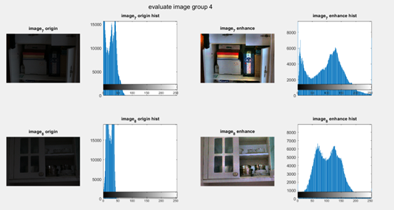
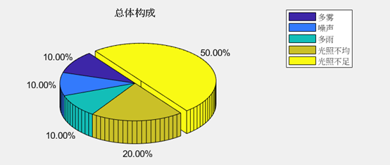

# Low_Light_Enhance

[TOC]

## 环境配置

### 基于HSV空间改进融合Retinex算法的井下图像增强方法

```matlab
clear
close all

% 首先读照片

I = imread(".\143.jpg");

% 将原图转换到HSV空间
hsv = rgb2hsv(I);

% 分别将h, s, v的分量提取出来
imgh = hsv(:,:,1);
imgs = hsv(:,:,2);
imgv = hsv(:,:,3);

% 备份一份原s0，原v0作为对比度调整
s0 = hsv(:,:,2);
v0 = hsv(:,:,3);

% 建立vhigh 和 vlow矩阵
[height, width] = size(imgv);
vhigh = zeros(height, width);
vlow = zeros(height, width);

%w为双边滤波的窗口宽度
w = 64;

%sigma_r为空间域标准差
%sigma_d为灰度值标准差
   
sigma_r = [100 150 200];
sigma_d = [0.3 0.45 0.6];

%{
sigma_r = [15 70 110];
sigma_d = [0.05 0.10 0.15];
%}
% 修正函数值
k = 1;

% MSR的过程，最佳状态一般取3次
for g=1:3
    % 对每个像素开始求解
    for i=1:height
        for j=1:width
            iMin = max(i-w, 1);
            iMax = min(i+w, height);
            jMin = max(j-w, 1);
            jMax = min(j+w, width);
            temp = double(imgv(iMin:iMax, jMin:jMax));
	        [row, col] = size(temp);
	        i0 = floor((row+1)/2);
	        j0 = floor((col+1)/2);
	        Gs = zeros(row, col);
	        Gr = zeros(row, col);
	        for p=1:row
		                for q=1:col
			                diss = temp(p, q) - temp(i0, j0);
			                if diss <= sigma_r / 4
				                Gs(p, q) = exp(-((p-i0)^2 + (q-j0)^2)*(k/sqrt((p-i0)^2 + (q-j0)^2)) / (2 * sigma_r(g) * sigma_r(g)));
                            else                    
				                Gs(p, q) = exp(-((p-i0)^2 + (q-j0)^2) / (2 * sigma_r(g) * sigma_r(g)));
                    end
                            if isnan(Gs(p, q))
                                Gs(p, q) = 0;
                            end
			                Gr(p, q) = exp(-(diss ^ 2) / (2 * sigma_d(g) * sigma_d(g)));
		                end
                    end        
	                W = Gr .* Gs;
	                vlow(i, j) = sum(W(:).*temp(:))/sum(W(:));	                    
        end
        fprintf("MSR_%d %f%%\n", g, (i-1) / height * 100);
            end;
            vhigh=1/3*(exp(log(imgv) - log(vlow)) + vhigh);            
        end

        % 这里不使用伽马矫正等，使用自定义的算法去调整对比度
        shigh = adapts(s0, v0, vhigh, 0.4, 7);

        %转为RGB输出即可
        result=cat(3,imgh,shigh,vhigh);
result=hsv2rgb(result);
imwrite(result,'res_143.jpg');
figure(2);
subplot(121);imshow(I);title('原图');
subplot(122);imshow(result);title('基于双边滤波的MSR');
```


```matlab
function s = adapts(s0, v0, v, t, n)
    [ih, iw] = size(v0);
    s = zeros(ih, iw);
    w = (n-1)/2;
    for i=1:ih
        for j=1:iw
            %{
            改进
            if s0(i, j) == 0
                s(i, j) = 0;
                continue;
            end
            %}
            iMin = max(i-w, 1);
            iMax = min(i+w, ih);
            jMin = max(j-w, 1);
            jMax = min(j+w, iw);
            
            v_W = v0(iMin:iMax, jMin:jMax);
            v_bar = mean(v_W(:));
            s_W = s0(iMin:iMax, jMin:jMax);
            s_bar = mean(s_W(:));

            v_res = v_W - v_bar;
            s_res = s_W - s_bar;
            
            v_s = v_res .* s_res;
            v_s = abs(v_s);

            v_sigma = (v_W - v_bar).^2;
            v_sigma = sum(v_sigma(:));

            s_sigma = (s_W - s_bar).^2;
            s_sigma = sum(s_sigma(:));

            v_s_sigma = sqrt(v_sigma * s_sigma);
            lamda = sum(v_s(:)) / v_s_sigma;
            %--
            t = s0(i, j) + t * (v(i, j) - v0(i, j)) * lamda;
            if(isnan(s(i, j)))
                s(i, j) = s0(i, j);
            else
                s(i, j) = t;
            end
        end
    end

end
```

### Uretinex-net

### 环境


| 包          | 版本         |
| ----------- | ------------ |
| python      | 3.8.18       |
| torch       | 1.9.0+cu111  |
| torchvision | 0.10.0+cu111 |

详情可见requirements.txt

## 数据集对比

### HSV

#### LOL




#### CUMT


#### 客观评价指标

##### 图像熵


##### 对比度变化率


##### 色调变化率


##### 能量梯度函数


##### 方差函数


##### 自相关函数


### Uretinex-net

#### LOL


#### CUMT


#### 客观评价指标

##### PSNR


##### SSIM


##### NIQE


### 两种增强方法对比

#### LOL


#### CUMT


### 细节对比


## 自制数据集




## 自制数据集增强效果

### HSV


### Uretinex_net


### 对比


### 细节对比


## 参考文献

[1]  张立亚,郝博南,孟庆勇等.基于HSV空间改进融合Retinex算法的井下图像增强方法[J].煤炭学报,2020,45(S1):532-540.

[2]  王洪栋,郭伟东,朱美强等.一种煤矿井下低照度图像增强算法[J].工矿自动化,2019,45(11):81-85.

[3] W. Wu, et al.“Uretinex-net: retinex-based deep unfolding network for low-light image enhancement” Proc. of the IEEE Comput. Soc. Conf. Comput. Vis. Pattern Recognit., pp. 5901-5910, 2022.

[4] Lu Y, Jung S W. Progressive joint low-light enhancement and noise removal for raw images[J]. IEEE Transactions on Image Processing, 2022, 31: 2390-2404.

[5] HSV色彩空间的Retinex结构光图像增强算法